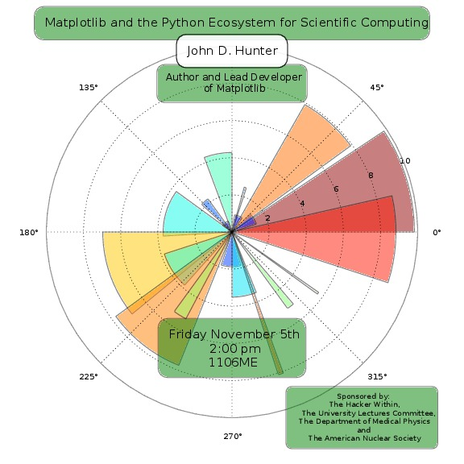
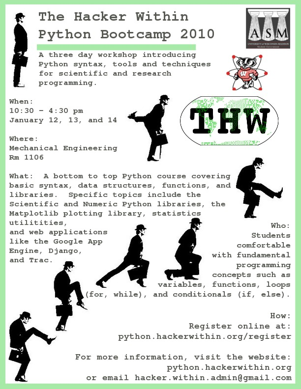
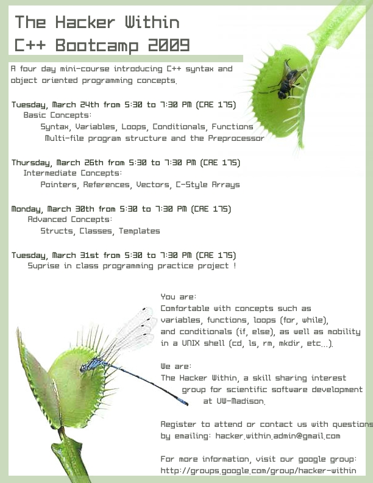
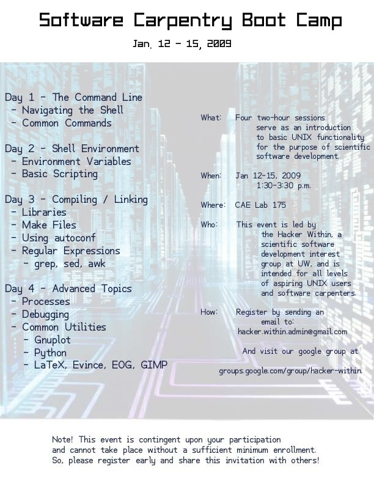
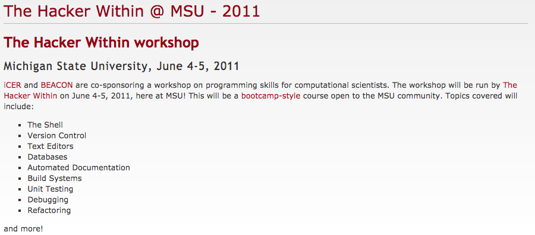

The Hacker Within began as a student organization at the University of
Wisconsin-Madison, and is now reborn as a collection of such chapters around
the world.

Each of the chapters convenes a community of scientists, at all levels of
their education and training, to share their knowledge and best practices in
using computing to accomplish their work.

Current chapters:

  * [U. California-Berkeley](http://thehackerwithin.github.io/berkeley) (USA)
  * [U. Wisconsin-Madison](http://thehackerwithin.github.io/wisconsin) (USA)

Nascent chapters:

  * [Swinburne](http://thehackerwithin.github.io/swinburne) (Australia)
  * [U. Melbourne](http://thehackerwithin.github.io/melbourne) (Australia)
  * [Yale] (http://thehackerwithin.github.io/yale) (USA)
  * [Michigan State] (http://thehackerwithin.github.io/msu) (USA)

----

In the past, at Wisconsin, we hosted events and bootcamps of many flavors. 

We have even been invited to host workshops elsewhere.

